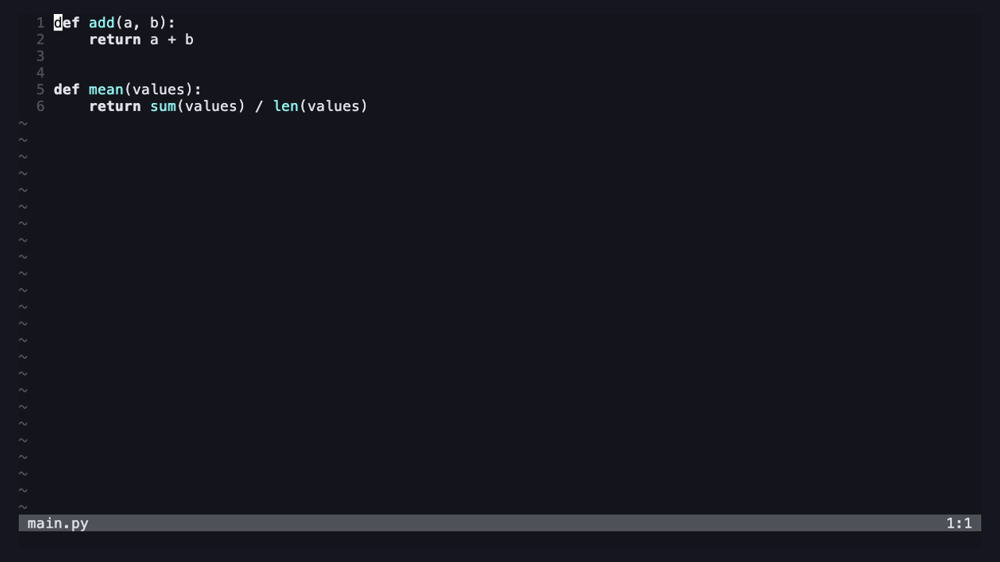

<div align="center">

# aicli.nvim

[](https://neovim.io)
[](LICENSE)


Run CLI coding agents such as [Claude Code](https://claude.com/claude-code) and
[Codex CLI](https://developers.openai.com/codex/cli) in a floating Neovim
terminal. No plugin dependencies.



</div>

- **One session per project.** Each agent starts at the project root of the
  current buffer, and each root keeps its own session.
- **Hiding is not quitting.** The CLI keeps running while its window is hidden.
- **Edited files reload.** Buffers the agent changed on disk are refreshed.
- **Any CLI.** Add a provider entry to get a command and a key for it.

## Quick start

Once [installed](#installation), in any file of a project:

1. `<leader>ac` opens Claude Code in a float at the project root
   (`<leader>ax` for Codex CLI, `<leader>aa` to pick).
2. Ask it to change something. `<C-q>` hides the window; the agent keeps
   running, and the buffers it edited reload.
3. `<leader>ac` again brings back the same conversation.

## Why not a general toggle terminal?

[toggleterm.nvim](https://github.com/akinsho/toggleterm.nvim),
[snacks.nvim](https://github.com/folke/snacks.nvim)'s terminal or a plain
`:terminal` can all run `claude` in a float, and they are the better choice for
general shell work (splits, numbered shells, sending lines to a REPL).

Terminal agents are a narrower job: they edit your files for minutes at a
time and hold a conversation about one project. aicli.nvim ships the pieces
you would otherwise add on top of a terminal plugin for that:

| To get this | On a general terminal plugin | aicli.nvim |
| --- | --- | --- |
| A separate conversation per project | Give each project its own terminal ID and working directory | Keyed by agent and project root, found from the current buffer |
| See the agent's edits in open buffers | Add a `:checktime` autocmd | Built in (`auto_reload`) |
| Several agents | Define a terminal and a mapping for each | One `providers` entry gives a command, a key and a picker entry |
| Offer only installed agents | Check the executables yourself | The picker skips missing ones; `:checkhealth aicli` shows each path |
| Keep `<Esc>` for the agent | Avoid the common `<Esc><Esc>` → normal mode mapping | `<Esc>` is not mapped by default |

It does nothing else: the window is always a float, and there is one kind of
terminal.

## Requirements

- Neovim 0.11 or newer
- At least one agent CLI on your `$PATH`

## Installation

With [lazy.nvim](https://github.com/folke/lazy.nvim):

```lua
{
  "g-hoshino/aicli.nvim",
  cmd = { "Aicli", "Claude", "Codex" },
  keys = { "<leader>aa", "<leader>ac", "<leader>ax" },
  opts = {},
}
```

With any other plugin manager, call `require("aicli").setup()`. It creates the
provider commands and keys; without it only `:Aicli`, `:AicliToggle` and
`:AicliStatus` exist.

## Usage

| Action | Command | Key |
| --- | --- | --- |
| Pick an installed agent | `:Aicli` | `<leader>aa` |
| Toggle Claude Code | `:Claude` | `<leader>ac` |
| Toggle Codex CLI | `:Codex` | `<leader>ax` |
| Toggle a provider by name | `:AicliToggle {name}` | |
| List sessions and their state | `:AicliStatus` | |

Toggling hides the window when the cursor is in it, and otherwise shows it and
moves the cursor there. Each tab page shows one agent window at a time.

Inside the window, `<C-q>` hides it and `<C-\><C-n>` leaves terminal mode.
`<Esc>` and `<C-e>` are left to the agent.

## Configuration

Defaults:

```lua
require("aicli").setup({
  -- Replaces the default list when set.
  providers = {
    { name = "Claude", cmd = "claude", key = "<leader>ac", command = "Claude" },
    { name = "Codex",  cmd = "codex",  key = "<leader>ax", command = "Codex" },
  },
  select_key = "<leader>aa",
  root_markers = { ".git", ".hg", "pyproject.toml", "Cargo.toml", "package.json", "go.mod" },
  float = { width = 0.5, height = 0.9, border = "rounded" }, -- fractions of the editor
  keys = { normal_mode = false, hide = "<C-q>" },
  start_insert = true,
  close_on_exit = false,
  auto_reload = true,
  env = nil,
  on_open = nil, -- function(term)
  on_exit = nil, -- function(term, code)
})
```

A provider also accepts `args` (extra arguments) and `env` (its own environment
variables). For example, to resume the last Claude Code session:

```lua
{ name = "Claude", cmd = "claude", args = { "--continue" }, key = "<leader>ac", command = "Claude" }
```

## API

```lua
local aicli = require("aicli")
aicli.toggle("Claude")   -- same as :Claude
aicli.open("Claude")     -- show it, starting the CLI if needed
aicli.close("Claude")    -- hide it, leaving the CLI running
aicli.shutdown("Claude") -- stop the CLI
aicli.select()           -- pick via vim.ui.select
aicli.status()           -- report every session
aicli.list()             -- every terminal object
```

See `:help aicli.txt` for every option and highlight group, and run
`:checkhealth aicli` if something does not work.

## License

MIT
